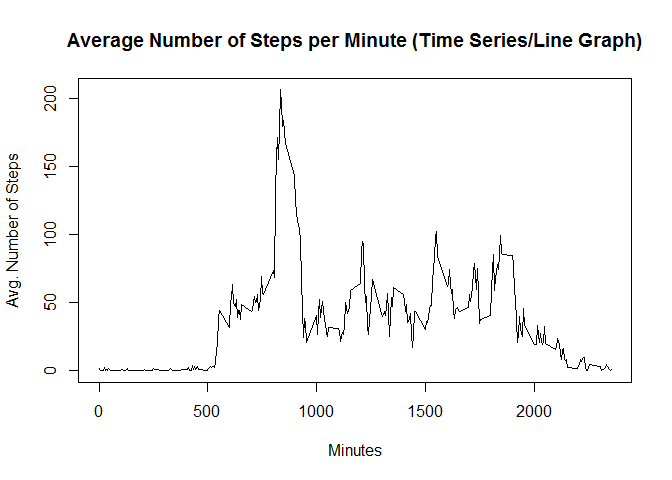

# Reproducible Research: Peer Assessment 1
#### Alden knibbs
#### 2017-11-08

## Loading and preprocessing the data
Show any code that is needed to

1.Load the data (i.e. read.csv())


```r
require(lattice)
```

```
## Loading required package: lattice
```

```
## Warning: package 'lattice' was built under R version 3.3.1
```

```r
dataset_url <- "https://d396qusza40orc.cloudfront.net/repdata%2Fdata%2Factivity.zip"

download.file(dataset_url, dest = "repdata_data_activity.zip", mode = "wb")

unzip("repdata_data_activity.zip")

activity <- read.csv("activity.csv")
```

2.Process/transform the data (if necessary) into a format suitable for your analysis

Add a factor variable called dayofweek to classify each day to deterime each day of the week for each date.


```r
activity$dayofweek <- weekdays(as.Date(activity$date))
```

Add a factor variable called daycategory to classify each day of the week as either a weekday or a weekend.


```r
activity$daycategory <- ifelse(activity$dayofweek == "Saturday" | activity$dayofweek == "Sunday",
                                "Weekend", "Weekday"
                                )
```

What do the data look like?

```r
head(activity)
```

```
##   steps       date interval dayofweek daycategory
## 1    NA 2012-10-01        0    Monday     Weekday
## 2    NA 2012-10-01        5    Monday     Weekday
## 3    NA 2012-10-01       10    Monday     Weekday
## 4    NA 2012-10-01       15    Monday     Weekday
## 5    NA 2012-10-01       20    Monday     Weekday
## 6    NA 2012-10-01       25    Monday     Weekday
```

Provide a summary of the data.

```r
summary(activity)
```

```
##      steps                date          interval       dayofweek        
##  Min.   :  0.00   2012-10-01:  288   Min.   :   0.0   Length:17568      
##  1st Qu.:  0.00   2012-10-02:  288   1st Qu.: 588.8   Class :character  
##  Median :  0.00   2012-10-03:  288   Median :1177.5   Mode  :character  
##  Mean   : 37.38   2012-10-04:  288   Mean   :1177.5                     
##  3rd Qu.: 12.00   2012-10-05:  288   3rd Qu.:1766.2                     
##  Max.   :806.00   2012-10-06:  288   Max.   :2355.0                     
##  NA's   :2304     (Other)   :15840                                      
##  daycategory       
##  Length:17568      
##  Class :character  
##  Mode  :character  
##                    
##                    
##                    
## 
```


## What is mean total number of steps taken per day?
For this part of the assignment, you can ignore the missing values in the dataset.

1.Calculate the total number of steps taken per day

Write some code that will sum the steps take per day while ignoring the missing values.

```r
stepsperday <- aggregate(activity$steps, 
                         by = list(activity$date), 
                         FUN = sum, 
                         na.rm = TRUE
                         )

names(stepsperday) <- c("date", "sum")
```

Verify results of above code.

```r
head(stepsperday)
```

```
##         date   sum
## 1 2012-10-01     0
## 2 2012-10-02   126
## 3 2012-10-03 11352
## 4 2012-10-04 12116
## 5 2012-10-05 13294
## 6 2012-10-06 15420
```

2.If you do not understand the difference between a histogram and a barplot, research the difference between them. Make a histogram of the total number of steps taken each day


```r
hist(stepsperday$sum,
     xlab = "Steps",
     main = "Histogram of Steps Daily"
     )
```

<!-- -->

3.Calculate and report the mean and median of the total number of steps taken per day

Report the mean.

```r
mean(stepsperday$sum)
```

```
## [1] 9354.23
```

Report the median.

```r
median(stepsperday$sum)
```

```
## [1] 10395
```

## What is the average daily activity pattern?

1.Make a time series plot (i.e. type = "l") of the 5-minute interval (x-axis) and the average number of steps taken, averaged across all days (y-axis)


```r
meanstepsperday <- aggregate(activity$steps,
                             by = list(activity$interval),
                             FUN = mean,
                             na.rm = TRUE
                             )

names(meanstepsperday) <- c("interval", "mean")
```

Verify results of above code.

```r
head(meanstepsperday)
```

```
##   interval      mean
## 1        0 1.7169811
## 2        5 0.3396226
## 3       10 0.1320755
## 4       15 0.1509434
## 5       20 0.0754717
## 6       25 2.0943396
```

Create time series plot.

```r
plot(meanstepsperday$interval,
     meanstepsperday$mean,
     type = "l",
     xlab = "Minutes",
     ylab = "Avg. Number of Steps",
     main = "Average Number of Steps per Minute (Time Series/Line Graph)"
     )
```

<!-- -->

2.Which 5-minute interval, on average across all the days in the dataset, contains the maximum number of steps?


```r
maxsteps <- which(meanstepsperday$mean == max(meanstepsperday$mean))

meanstepsperday[maxsteps, 1]
```

```
## [1] 835
```

## Imputing missing values
Note that there are a number of days/intervals where there are missing values (coded as NA). The presence of missing days may introduce bias into some calculations or summaries of the data.

1.Calculate and report the total number of missing values in the dataset (i.e. the total number of rows with NAs)

As determined by the summary function there are 2304 missing values (NA) is the dataset.


```r
summary(activity)
```

```
##      steps                date          interval       dayofweek        
##  Min.   :  0.00   2012-10-01:  288   Min.   :   0.0   Length:17568      
##  1st Qu.:  0.00   2012-10-02:  288   1st Qu.: 588.8   Class :character  
##  Median :  0.00   2012-10-03:  288   Median :1177.5   Mode  :character  
##  Mean   : 37.38   2012-10-04:  288   Mean   :1177.5                     
##  3rd Qu.: 12.00   2012-10-05:  288   3rd Qu.:1766.2                     
##  Max.   :806.00   2012-10-06:  288   Max.   :2355.0                     
##  NA's   :2304     (Other)   :15840                                      
##  daycategory       
##  Length:17568      
##  Class :character  
##  Mode  :character  
##                    
##                    
##                    
## 
```

2.Devise a strategy for filling in all of the missing values in the dataset. The strategy does not need to be sophisticated. For example, you could use the mean/median for that day, or the mean for that 5-minute interval, etc.

Replace the missing values with the mean steps per day by...

   Finding the postion of the missing values in the dataset.


```r
naposition <- which(is.na(activity$steps))
```

   Create a set of means.


```r
means <- rep(mean(activity$steps, na.rm = TRUE), times = length(naposition))
```

3.Create a new dataset that is equal to the original dataset but with the missing data filled in.

Replace missing values with the means


```r
activity[naposition, "steps"] <- means
```

Validate missing value replacement strategy.


```r
head(activity)
```

```
##     steps       date interval dayofweek daycategory
## 1 37.3826 2012-10-01        0    Monday     Weekday
## 2 37.3826 2012-10-01        5    Monday     Weekday
## 3 37.3826 2012-10-01       10    Monday     Weekday
## 4 37.3826 2012-10-01       15    Monday     Weekday
## 5 37.3826 2012-10-01       20    Monday     Weekday
## 6 37.3826 2012-10-01       25    Monday     Weekday
```

4.Make a histogram of the total number of steps taken each day and Calculate and report the mean and median total number of steps taken per day. Do these values differ from the estimates from the first part of the assignment? What is the impact of imputing missing data on the estimates of the total daily number of steps?


```r
stepsperday <- aggregate(activity$steps, 
                         by = list(activity$date), 
                         FUN = sum, 
                         na.rm = TRUE
                         )

names(stepsperday) <- c("date", "sum")
```


```r
hist(stepsperday$sum,
     xlab = "Steps",
     main = "Histogram of Steps Daily after Replacing Missing Values"
     )
```

<!-- -->

Report the mean.

```r
mean(stepsperday$sum)
```

```
## [1] 10766.19
```

Report the median.

```r
median(stepsperday$sum)
```

```
## [1] 10766.19
```

Replacing the missing values with the mean has made the mean and the mode (10766) the same value.

## Are there differences in activity patterns between weekdays and weekends?
For this part the weekdays() function may be of some help here. Use the dataset with the filled-in missing values for this part.

1.Create a new factor variable in the dataset with two levels - "weekday" and "weekend" indicating whether a given date is a weekday or weekend day.

Task completed in the processing phase.


```r
activity[1:5,]
```

```
##     steps       date interval dayofweek daycategory
## 1 37.3826 2012-10-01        0    Monday     Weekday
## 2 37.3826 2012-10-01        5    Monday     Weekday
## 3 37.3826 2012-10-01       10    Monday     Weekday
## 4 37.3826 2012-10-01       15    Monday     Weekday
## 5 37.3826 2012-10-01       20    Monday     Weekday
```

2.Make a panel plot containing a time series plot (i.e. type = "l") of the 5-minute interval (x-axis) and the average number of steps taken, averaged across all weekday days or weekend days (y-axis). See the README file in the GitHub repository to see an example of what this plot should look like using simulated data.


```r
meansdayofweek <- aggregate(activity$steps,
                            by = list(activity$daycategory,
                                      activity$dayofweek,
                                      activity$interval
                                      ),
                            mean
                            )

names(meansdayofweek) <- c("daycategory", "dayofweek", "interval", "mean")
```

Verify results of above code

```r
meansdayofweek[1:5,]
```

```
##   daycategory dayofweek interval     mean
## 1     Weekday    Friday        0 8.307244
## 2     Weekday    Monday        0 9.418355
## 3     Weekend  Saturday        0 4.672825
## 4     Weekend    Sunday        0 4.672825
## 5     Weekday  Thursday        0 9.375844
```

Build time series plot for type = "l".

```r
xyplot(mean ~ interval | daycategory, meansdayofweek,
       type = "l",
       xlab = "Interval",
       ylab = "Steps",
       layout = c(1,2)
       )
```

<!-- -->


